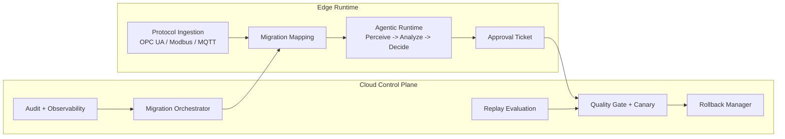

<p align="center">
  
</p>

<h1 align="center">agentic-maas</h1>
<p align="center"><strong>工业 B 端 Agentic MaaS 端到端迁移开源库</strong></p>

<p align="center">
  Python-first | Edge Runtime + Cloud Control Plane | Human-in-the-loop Approval
</p>

## 这是什么
`agentic-maas` 是一个面向工业/IoT B 端场景的开源框架，目标是把传统算法与异构现场测点，迁移到可治理、可灰度、可回滚的 Agentic + LLM 体系。

它重点解决两件事：
- 物理系统传感器测点配置迁移（OPC UA / Modbus / MQTT）
- 传统规则/算法向 Agentic 工作流的分层自适应迁移

## 核心特性
- 统一数据模型：`SensorPoint`、`MigrationSpec`、`DecisionAction`、`EvalReport` 等
- 协议接入适配器：`opcua`、`modbus`、`mqtt`
- MaaS Provider SPI：兼容本地私有与国产模型网关（vLLM / Qwen / DeepSeek）
- 迁移引擎：映射、单位换算、质量校验、差异报告
- 评测与门禁：离线回放 + 质量阈值阻断
- 分层自适应：离线校准 + 在线 Thompson Sampling
- 安全上线：人在环审批 + 白名单策略 + 灰度发布 + 一键回滚

## 架构概览


## 目录结构
```text
.
├── assets/
│   └── logo.svg
├── src/agentic_maas/
│   ├── api/            # FastAPI 控制面
│   ├── ingestion/      # 协议适配器与注册
│   ├── migration/      # 测点迁移与算法模板映射
│   ├── evaluation/     # 回放评测与门禁
│   ├── adaptation/     # 校准与 bandit
│   ├── approval/       # 审批网关
│   ├── deployment/     # 灰度与回滚
│   ├── providers/      # 模型 provider 抽象
│   ├── runtime/        # Agent 状态机运行时
│   └── store/          # 存储层（当前内存实现）
├── tests/
├── docker-compose.yml
└── charts/agentic-maas/
```

## 快速开始
### 1) 环境
- Python 3.11+
- 可选：Docker（用于本地一键运行控制面）

### 2) 安装
```bash
python -m venv .venv
source .venv/bin/activate
pip install -e .[dev]
```

### 3) 启动控制面
```bash
uvicorn agentic_maas.api.app:app --reload --port 8000
```

### 4) 运行测试
```bash
pytest
```

## API 一览
- `POST /v1/migrations` 创建迁移任务
- `GET /v1/migrations/{id}` 查询迁移任务
- `POST /v1/evals/replay` 启动离线回放评测
- `POST /v1/deployments/canary` 发起灰度发布
- `POST /v1/approvals/{ticket_id}/approve` 审批动作
- `POST /v1/deployments/{id}/rollback` 执行回滚

补充端点：
- `POST /v1/approvals` 创建审批单
- `POST /v1/ingestion/{protocol}/discover` 发现测点
- `GET /health` 健康状态

## CLI 示例
输出示例测点 JSON：
```bash
python -m agentic_maas.cli sample-points
```

从测点草拟映射规则：
```bash
python -m agentic_maas.cli draft-mapping --points ./points.json
```

执行映射并查看差异：
```bash
python -m agentic_maas.cli apply-mapping --points ./points.json --rules ./rules.json
```

## 设计原则
- 安全优先：默认人在环，不做无审批自动控制写入
- 渐进迁移：先兼容 baseline，再逐步引入 Agentic 策略
- 可运维：评测门禁、灰度发布、审计追踪、可回滚
- 去供应商锁定：统一 Provider SPI

## 路线图
- [x] v0.1：核心类型、SPI、控制面主 API、三协议适配器、迁移/评测/审批/灰度/回滚
- [ ] v0.2：PostgreSQL/TimescaleDB 与 NATS 持久化与消息流实现
- [ ] v0.3：LangGraph 工作流深度集成、策略模板市场、行业 Demo
- [ ] v1.0：生产级多租户、审计增强、SLO/SLA 套件

## 贡献
欢迎提交 Issue / PR。建议先讨论：
- 场景需求（设备类型、时延要求、风险等级）
- 协议兼容性（OPC UA/Modbus 细分实现差异）
- 模型生态（私有化部署约束、国产模型接入方式）

## License
Apache-2.0
