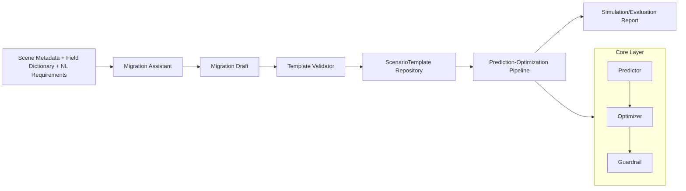

<p align="center">
  
</p>

<h1 align="center">EasyShift-MaaS</h1>
<p align="center"><strong>面向 To-B 的 MAAS 迁移型 Agentic + 预测-优化可复用框架</strong></p>

<p align="center">
  Migration-first | Reusable Prediction-Optimization Pattern | Python SDK + FastAPI
</p>

## 1. 项目定位
EasyShift-MaaS 聚焦于 **MAAS 功能迁移的基础能力**，目标是在不同 To-B 场景中快速复用“预测-优化”模式，而不是绑定某个行业的专有逻辑。

本项目强调两件事：
- **可迁移性**：通过模板化和 Agentic 迁移助手，把旧场景配置迁移到新场景。
- **可复用性**：通过标准化四层内核（Data Contract / Predictor / Optimizer / Guardrail）复用算法工作流。

## 2. 安全与合规声明
- 本仓库仅包含通用框架和**合成示例**。
- 不包含任何商用 demo 的代码、数据、参数、模型或规则文本。
- 内置非泄漏扫描（CI + 本地脚本）用于阻止敏感资产误提交。

## 3. 核心能力
- 四层内核：`Data Contract + Predictor + Optimizer + Guardrail`
- 场景模板：`ScenarioTemplate` 版本化发布、JSON/YAML 导入导出
- 迁移助手：`SceneMetadata + FieldDictionary + NL Requirements -> MigrationDraft`
- 迁移校验：正确性评分、约束冲突率、守护规则覆盖率
- 回归规划：自动生成合成回归用例
- 服务入口：FastAPI 主线接口覆盖模板生成/校验/发布与 pipeline 仿真/评测

## 4. 架构概览


## 5. 包结构
```text
src/easyshift_maas/
├── core/
│   ├── contracts.py
│   ├── predictor.py
│   ├── optimizer.py
│   ├── guardrail.py
│   └── pipeline.py
├── agentic/
│   ├── migration_assistant.py
│   ├── template_validator.py
│   └── regression_planner.py
├── templates/
│   ├── schema.py
│   └── repository.py
├── api/
│   └── app.py
├── examples/
│   ├── synthetic_templates.py
│   └── data/
└── cli.py
```

## 6. 快速开始
### 6.1 环境
- Python 3.11+

### 6.2 安装
```bash
python -m venv .venv
source .venv/bin/activate
pip install -e .[dev]
```

### 6.3 启动 API
```bash
uvicorn easyshift_maas.api.app:app --reload --port 8000
```

### 6.4 运行测试
```bash
pytest
```

## 7. API 主线
- `POST /v1/templates/generate` 生成迁移草案
- `POST /v1/templates/validate` 校验迁移草案
- `POST /v1/templates/publish` 发布模板版本
- `GET /v1/templates/{template_id}` 获取模板详情
- `POST /v1/pipeline/simulate` 单次仿真
- `POST /v1/pipeline/evaluate` 批量评测
- `GET /health` 健康状态

## 8. CLI 示例
输出合成模板：
```bash
easyshift-maas sample-template --variant energy
```

生成迁移草案：
```bash
easyshift-maas generate-draft \
  --metadata ./src/easyshift_maas/examples/data/scene_metadata.json \
  --fields ./src/easyshift_maas/examples/data/field_dictionary.json \
  --requirement "prioritize stability"
```

校验迁移草案：
```bash
easyshift-maas validate-draft --draft ./draft.json
```

运行仿真：
```bash
easyshift-maas simulate \
  --template ./template.json \
  --context ./src/easyshift_maas/examples/data/context.json
```

## 9. 迁移说明（破坏性切换）
本版本采用破坏性切换：
- 包名：`agentic_maas` -> `easyshift_maas`
- API 主线：旧迁移/部署路由切换为模板与仿真评测路由
- 数据契约：切换到 `ScenarioTemplate` / `MigrationDraft` / `MigrationValidationReport`

详细见：`docs/MIGRATION_GUIDE.md`

## 10. 开发与质量门禁
- 单元测试：`tests/unit`
- 契约测试：`tests/contract`
- 端到端测试：`tests/e2e`
- 敏感扫描：`python tools/sensitive_scan.py`

## 11. License
Apache-2.0
