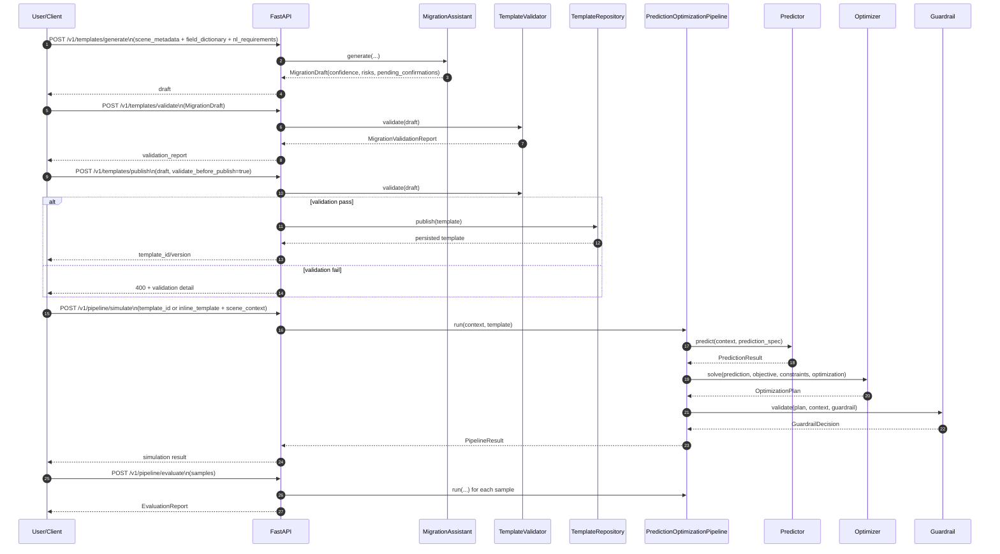

<p align="center">
  
</p>

<h1 align="center">EasyShift-MaaS</h1>
<p align="center"><strong>面向 To-B 的 MAAS 迁移型 Agentic + 预测-优化可复用框架</strong></p>

<p align="center">
  Migration-first | Reusable Prediction-Optimization Pattern | Python SDK + FastAPI
</p>

## 1. 这个库解决什么问题
EasyShift-MaaS 解决的是：
- 如何把一个场景里的“预测-优化”模式，迁移到另一个场景。
- 如何把迁移过程标准化，减少手工改配置和出错成本。

它把系统拆成两条主线：
- 迁移主线：`Generate Draft -> Validate -> Publish Template`
- 执行主线：`Simulate/Evaluate`（预测 -> 优化 -> 守护）

它默认不做自动闭环控制下发，只做可迁移性和可复用性的基础能力。

## 2. 基本运行逻辑（时序图）


## 3. 架构与目录
```text
src/easyshift_maas/
├── core/
│   ├── contracts.py
│   ├── predictor.py
│   ├── optimizer.py
│   ├── guardrail.py
│   └── pipeline.py
├── agentic/
│   ├── migration_assistant.py
│   ├── template_validator.py
│   └── regression_planner.py
├── templates/
│   ├── schema.py
│   └── repository.py
├── api/
│   └── app.py
├── examples/
│   ├── synthetic_templates.py
│   └── data/
└── cli.py
```

## 4. 安装和启动
### 4.1 环境
- Python 3.11+

### 4.2 安装
```bash
python -m venv .venv
source .venv/bin/activate
pip install -e .[dev]
```

### 4.3 启动 API
```bash
uvicorn easyshift_maas.api.app:app --reload --port 8000
```

### 4.4 运行测试
```bash
pytest
```

## 5. API 使用手册（输入、输出、含义）

### 5.1 `POST /v1/templates/generate`
用途：从场景元数据和字段字典生成迁移草案。

输入最小结构：
```json
{
  "scene_metadata": {
    "scene_id": "line-A",
    "scenario_type": "generic",
    "tags": ["synthetic"],
    "granularity_sec": 60,
    "execution_window_sec": 300
  },
  "field_dictionary": {
    "fields": [
      {
        "field_name": "energy_cost",
        "semantic_label": "cost",
        "unit": "$/h",
        "dimension": "dimensionless",
        "observable": true,
        "controllable": false,
        "missing_strategy": "required"
      }
    ],
    "alias_map": {}
  },
  "nl_requirements": ["prioritize stability"]
}
```

输出关键字段：
```json
{
  "draft_id": "draft-...",
  "template": {"template_id": "line-A-template", "version": "draft-1", "...": "..."},
  "confidence": 0.75,
  "pending_confirmations": ["..."],
  "risks": [{"code": "...", "message": "...", "severity": "warn"}],
  "generation_strategy": "rule_only_low_confidence"
}
```

解释：
- `confidence`：草案可信度。
- `generation_strategy`：生成策略（规则、混合、低置信度回退）。
- `pending_confirmations`：必须人工确认的项。

### 5.2 `POST /v1/templates/validate`
用途：校验草案是否可发布。

输入：完整 `MigrationDraft`。

输出关键字段：
```json
{
  "draft_id": "draft-...",
  "valid": true,
  "correctness_score": 0.98,
  "conflict_rate": 0.0,
  "guardrail_coverage": 1.0,
  "issues": []
}
```

解释：
- `valid=true` 才建议发布。
- 内部门槛：正确性 >= 0.95、冲突率 <= 0.02、守护覆盖率 >= 0.95。

### 5.3 `POST /v1/templates/publish`
用途：发布模板到仓储。

输入：
```json
{
  "draft": {"...": "完整 MigrationDraft"},
  "validate_before_publish": true
}
```

成功输出：
```json
{
  "template_id": "line-A-template",
  "version": "draft-1",
  "validation": {"valid": true, "...": "..."}
}
```

失败输出（400）：
- `migration draft failed validation`
- 同时返回详细 `report`。

### 5.4 `GET /v1/templates/{template_id}`
用途：获取已发布模板。

输入：
- 路径参数：`template_id`
- 可选查询参数：`version`

输出：`ScenarioTemplate`。

### 5.5 `POST /v1/pipeline/simulate`
用途：执行一次预测-优化仿真。

输入要求：
- 必须二选一：`template_id` 或 `inline_template`。
- 同时提供 `scene_context`。

输入示例（按 `template_id`）：
```json
{
  "template_id": "line-A-template",
  "scene_context": {
    "values": {"energy_cost": 100.0, "boiler_temp": 560.0},
    "metadata": {}
  }
}
```

输出关键字段：
```json
{
  "template_id": "line-A-template",
  "prediction": {"predictions": {"...": 0.0}, "model_signature": "...", "diagnostics": {}},
  "plan": {"recommended_setpoints": {"...": 0.0}, "objective_value": 0.0, "solver_status": "solved", "diagnostics": {}},
  "guardrail": {"approved": true, "violations": [], "action": "warn", "adjusted_setpoints": {"...": 0.0}},
  "final_setpoints": {"...": 0.0},
  "executed": true
}
```

### 5.6 `POST /v1/pipeline/evaluate`
用途：批量样本评测。

输入示例：
```json
{
  "scenario_id": "eval-1",
  "template_id": "line-A-template",
  "samples": [
    {
      "context": {"values": {"energy_cost": 100.0, "boiler_temp": 560.0}, "metadata": {}},
      "expected_approved": true
    }
  ]
}
```

输出：
```json
{
  "scenario_id": "eval-1",
  "total_runs": 1,
  "approval_rate": 1.0,
  "mean_objective": -12.3,
  "violation_rate": 0.0,
  "expectation_match_rate": 1.0
}
```

### 5.7 `GET /health`
输出组件状态与当前内存模板数量。

## 6. 如果有问题，怎么调整

### 6.1 发布时返回 `400 migration draft failed validation`
怎么查：看返回里的 `validation.report.issues`。
怎么改：
- `OBJ_FIELD_UNKNOWN`：目标字段不在 `field_dictionary` 中，先修字段字典。
- `PRED_FEATURE_UNKNOWN`：预测特征不在字段字典中，修 `prediction.feature_fields`。
- `CONSTRAINT_CONFLICT_*`：约束冲突，重排边界或调整 hard/soft。

### 6.2 返回 `422`（请求校验失败）
常见原因：
- `/simulate` 和 `/evaluate` 同时传了 `template_id` 与 `inline_template`，或两者都没传。
- 输入 JSON 缺字段/类型不匹配。
调整方式：
- 保证模板来源二选一。
- 按 `contracts.py` 对应结构补齐字段。

### 6.3 返回 `404 template not found`
原因：模板未发布，或服务重启后内存仓储清空。
调整方式：
- 先执行 `generate -> validate -> publish`。
- 如果需要持久化，替换 `InMemoryTemplateRepository` 为数据库实现。

### 6.4 迁移草案置信度低（`generation_strategy=rule_only_low_confidence`）
调整方式：
- 增加字段语义信息（`semantic_label`、单位、可控性）。
- 补充更明确的 `nl_requirements`。
- 注入 `llm_suggester` 进行混合建议。

### 6.5 仿真结果 `executed=false`
原因：守护规则触发 `reject`。
调整方式：
- 调整 `GuardrailRule` 的 `max_delta/min/max`。
- 先定位 `violations` 字段，再校准约束与目标权重。

## 7. CLI 使用
输出合成模板：
```bash
easyshift-maas sample-template --variant energy
```

生成迁移草案：
```bash
easyshift-maas generate-draft \
  --metadata ./src/easyshift_maas/examples/data/scene_metadata.json \
  --fields ./src/easyshift_maas/examples/data/field_dictionary.json \
  --requirement "prioritize stability"
```

校验草案：
```bash
easyshift-maas validate-draft --draft ./draft.json
```

运行仿真：
```bash
easyshift-maas simulate \
  --template ./template.json \
  --context ./src/easyshift_maas/examples/data/context.json
```

## 8. 开发与质量门禁
- 单元测试：`tests/unit`
- 契约测试：`tests/contract`
- 端到端测试：`tests/e2e`
- 敏感扫描：`python tools/sensitive_scan.py`

## 9. 非泄漏与合规
- 仅保留 synthetic 示例。
- CI 自动执行敏感模式扫描：`.github/workflows/non-leakage.yml`。
- 禁止提交任何商用 demo 资产。

## 10. 迁移说明
这是破坏性切换版本：
- 包名：`agentic_maas` -> `easyshift_maas`
- API 主线：旧路由切换为模板迁移与仿真评测路由
- 契约中心：`ScenarioTemplate` / `MigrationDraft` / `MigrationValidationReport`

详细见：`docs/MIGRATION_GUIDE.md`。

## 11. License
Apache-2.0
