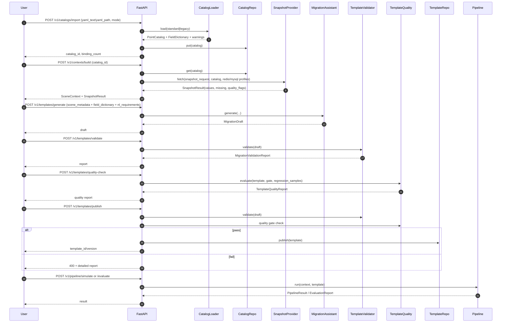

<p align="center">
  
</p>

<h1 align="center">EasyShift-MaaS</h1>
<p align="center"><strong>迁移型 Agentic + 预测-优化可复用框架（工业场景 v0.2）</strong></p>

<p align="center">
  YAML point catalog | Redis/MySQL indexing | Quality gates | Docker + Nuitka
</p>

## 1. 定位与边界
EasyShift-MaaS 面向 B 端 MAAS 迁移场景，核心目标是：
- 把工业现场点位 YAML 配置，标准化为可版本化 `PointCatalog`。
- 把“预测-优化”逻辑收敛到统一 `ScenarioTemplate` 契约。
- 通过 `TemplateValidator + TemplateQualityEvaluator` 实现可解释门禁。

默认不做自动闭环控制下发，只输出仿真结果与受守护规则约束的推荐值。

## 2. 运行主线（时序图）


## 3. 核心工具与作用映射
- `FastAPI`: 对外 API 入口（模板迁移、质量门禁、仿真评测）。
- `Pydantic v2`: 全部契约类型与 schema 校验。
- `YamlCatalogLoader`: 双模式 YAML（standard/legacy）解析。
- `CompositeSnapshotProvider`: Redis/MySQL 批量点位读取与归一化。
- `ChainedSecretResolver`: `env:` / `file:` 密钥注入。
- `TemplateValidator`: 结构与约束冲突校验。
- `TemplateQualityEvaluator`: 五层质量评分（结构/语义/可解/守护/回归）。
- `PredictionOptimizationPipeline`: Predictor -> Optimizer -> Guardrail 执行链。
- `Docker + Compose`: 本地联调（API + Redis + MySQL + secrets）。
- `Nuitka`: 产出 CLI/API 单文件可执行。

## 4. 项目结构
```text
src/easyshift_maas/
├── core/
├── ingestion/
│   ├── catalog_loader.py
│   ├── snapshot_provider.py
│   ├── repository.py
│   └── providers/{redis_provider.py,mysql_provider.py}
├── security/secrets.py
├── quality/template_quality.py
├── agentic/
├── templates/
├── api/app.py
├── cli.py
└── examples/data/
```

## 5. 快速开始
### 5.1 本地 Python 运行
```bash
python -m venv .venv
source .venv/bin/activate
pip install -e '.[dev]'
uvicorn easyshift_maas.api.app:app --reload --port 8000
```

### 5.2 Docker 联调（含 Redis/MySQL）
```bash
docker compose up --build
```
默认开发 secrets 位于 `deploy/secrets/`，仅用于本地演示。

### 5.3 5 分钟工业路径
1. 导入 catalog（标准 YAML）：
```bash
curl -X POST http://127.0.0.1:8000/v1/catalogs/import \
  -H 'Content-Type: application/json' \
  -d '{"mode":"standard","yaml_path":"./src/easyshift_maas/examples/data/catalog_standard.yaml"}'
```
2. 构建上下文（从 Redis/MySQL 拉取点位快照）：
```bash
curl -X POST http://127.0.0.1:8000/v1/contexts/build \
  -H 'Content-Type: application/json' \
  -d '{"catalog_id":"demo-line-catalog","missing_policy":"zero"}'
```
3. 生成迁移草案：
```bash
curl -X POST http://127.0.0.1:8000/v1/templates/generate \
  -H 'Content-Type: application/json' \
  -d @- <<'JSON'
{
  "scene_metadata": {"scene_id":"demo-line","scenario_type":"optimization","tags":["synthetic"],"granularity_sec":60,"execution_window_sec":300},
  "field_dictionary": {
    "fields": [
      {"field_name":"energy_cost","semantic_label":"cost","unit":"$/h","dimension":"dimensionless","observable":true,"controllable":false,"missing_strategy":"required"},
      {"field_name":"reactor_temp","semantic_label":"temperature","unit":"C","dimension":"dimensionless","observable":true,"controllable":true,"missing_strategy":"required"}
    ],
    "alias_map": {}
  },
  "nl_requirements": ["prioritize safety and stability"]
}
JSON
```
4. 校验 + 质量检查 + 发布：
```bash
# /v1/templates/validate
# /v1/templates/quality-check
# /v1/templates/publish
```
5. 执行 `/v1/pipeline/simulate` 或 `/v1/pipeline/evaluate`。

## 6. 输入规范
### 6.1 standard YAML（推荐）
见 `src/easyshift_maas/examples/data/catalog_standard.yaml`，核心块：
- `scene`
- `datasources`
- `point_catalog.bindings`
- `field_dictionary`
- `template_override(optional)`

### 6.2 legacy YAML（兼容）
见 `src/easyshift_maas/examples/data/catalog_legacy.yaml`，兼容特征：
- 顶层大量点位键（自动识别为 `PointBinding`）。
- `redis_config/mysql_config` 自动提取为 datasource profile 草案。
- 输出附带 `pending_confirmations`，提示人工确认映射。

### 6.3 关键 API 输入
- `POST /v1/catalogs/import`: `yaml_text | yaml_path` 二选一 + `mode`。
- `POST /v1/contexts/build`: `catalog_id` + `missing_policy` + 可选 `fields`。
- `POST /v1/templates/quality-check`: `draft | template` 二选一 + `gate`。

## 7. 输出规范
### 7.1 `SnapshotResult`
```json
{
  "values": {"reactor_temp": 520.0},
  "quality_flags": {"reactor_temp": "ok"},
  "missing_fields": [],
  "source_latency_ms": {"redis": 12},
  "collected_at": "2026-02-24T10:00:00Z"
}
```

### 7.2 `MigrationDraft`
包含 `template/confidence/risks/pending_confirmations/generation_strategy`。

### 7.3 `TemplateQualityReport`
```json
{
  "overall_score": 0.97,
  "structural_score": 1.0,
  "semantic_score": 1.0,
  "solvability_score": 0.96,
  "guardrail_coverage": 1.0,
  "regression_score": 0.91,
  "passed": true,
  "issues": []
}
```

### 7.4 `PipelineResult`
输出预测、优化计划、守护裁决、最终推荐值和 `executed`。

## 8. 模板正确性定义
质量门禁由五层组成：
1. 结构正确性：schema/类型/唯一性。
2. 语义正确性：目标/约束/特征/守护字段可解析。
3. 可解性：求解器在回归样本上可解。
4. 安全覆盖：objective + controllable 字段的守护覆盖率。
5. 回归表现：期望匹配率与违例率。

默认阈值：
- `structural >= 0.98`
- `semantic >= 0.98`
- `solvability >= 0.95`
- `guardrail >= 0.95`
- `regression >= 0.90`
- `overall >= 0.95`

## 9. 问题排查与调参
- `400 migration draft failed validation`: 先看 `detail.report.issues`，修字段引用和约束冲突。
- `400 template failed quality gate`: 调整 `ObjectiveSpec`、`ConstraintSpec`、`GuardrailSpec`，或补充 `regression_samples`。
- `400 missing fields in snapshot`: 使用 `missing_policy=zero/drop` 或修 datasource 连接。
- `404 catalog/template not found`: 先执行 import/publish。
- 点位规模大（1k-5k）: 调大 `DataSourceOptions.batch_size`，优化数据源索引列。

## 10. 部署与安全
- 配置连接：`conn_ref` 支持 `env:KEY`、`file:/path/to/secret.json`。
- 传输加密：Redis/MySQL profile 支持 `tls=true`。
- 容器密钥注入：`docker-compose.yml` 使用 Docker secrets。
- Helm: `charts/easyshift-maas/values.yaml` 支持 secretKeyRef 映射。
- 可执行分发：先 `pip install '.[build]'`，再运行 `scripts/build_nuitka.sh` 生成 `dist/easyshift-maas` 与 `dist/easyshift-maas-api`。

## 11. 非泄漏声明
- 示例、测试、文档全部使用 synthetic 数据。
- 仓库不包含任何商用 demo 资产。
- CI 保留敏感模式扫描：`tools/sensitive_scan.py`。

## 12. 相关文档
- `docs/ARCHITECTURE.md`
- `docs/API.md`
- `docs/MIGRATION_GUIDE.md`

## License
Apache-2.0
