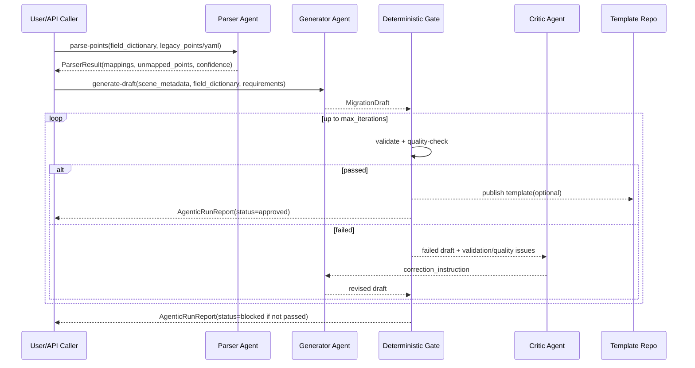

# 架构与运行逻辑

## 总体结构
ReflexFlow-MaaS v0.3 由四层组成：

1. 数据接入层
- 负责 YAML 点位导入、Redis/MySQL 快照读取、上下文构建。

2. Agent 层
- Parser Agent：legacy 点位语义映射。
- Generator Agent：迁移草案生成。
- Critic Agent：失败分析与修正指令。

3. 确定性校验层
- `TemplateValidator`：结构与字段合法性检查。
- `TemplateQualityEvaluator`：质量评分和阈值判定。

4. 执行评估层
- `PredictionOptimizationPipeline`：预测、优化、安全检查、仿真评估。

## 关键设计原则
1. LLM 只负责理解和翻译，不直接决定发布。
2. 发布由确定性门禁裁定。
3. 每次失败都产生可审计的修正记录。

## 时序图

## 每个工具的作用
1. `RoleBasedLLMClient`
- 统一对接 Kimi、Qwen、DeepSeek、OpenAI 的 OpenAI 兼容接口。

2. `ParserAgent`
- 解决遗留命名混乱问题，输出标准化映射来源。

3. `GeneratorAgent`
- 把自然语言和字段字典转成结构化迁移草案。

4. `TemplateValidator`
- 检查字段引用、约束冲突、安全规则覆盖。

5. `TemplateQualityEvaluator`
- 计算结构、语义、可解性、安全覆盖、回归评分。

6. `CriticAgent`
- 读取失败信息并输出明确修改指令。

7. `PredictionOptimizationPipeline`
- 在不闭环控制的前提下，完成仿真执行与评估。
